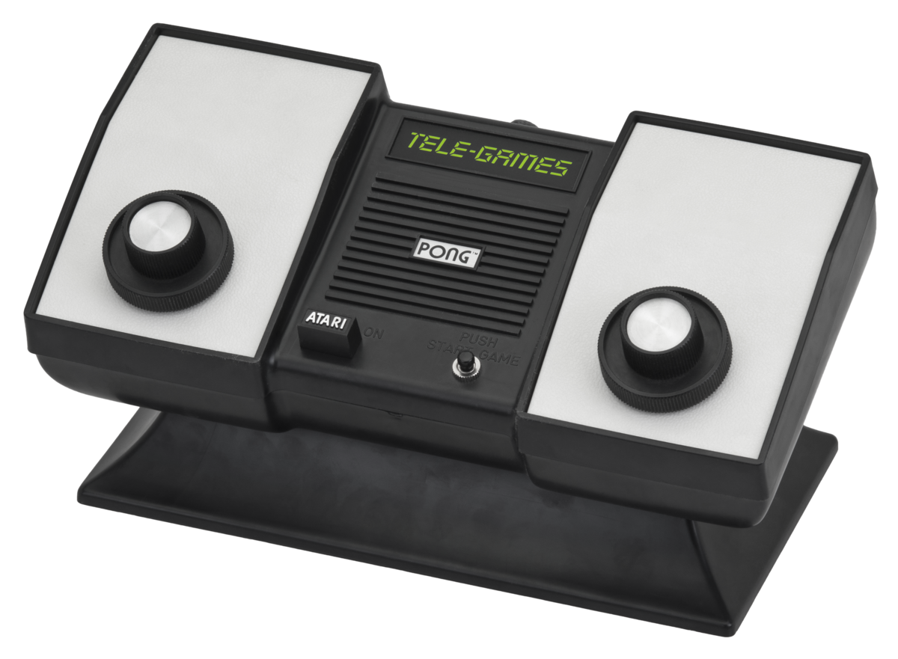
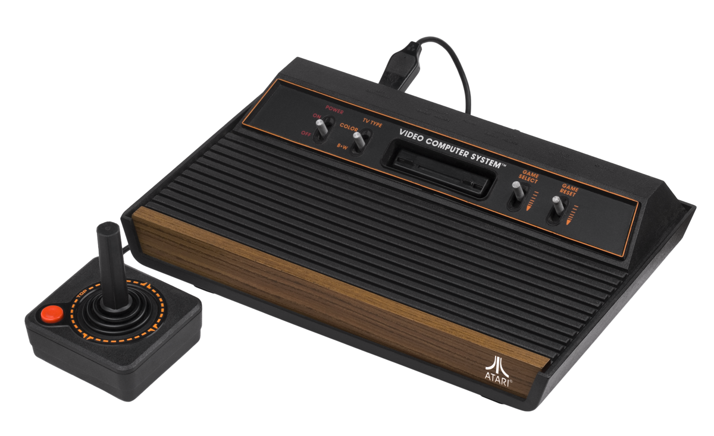
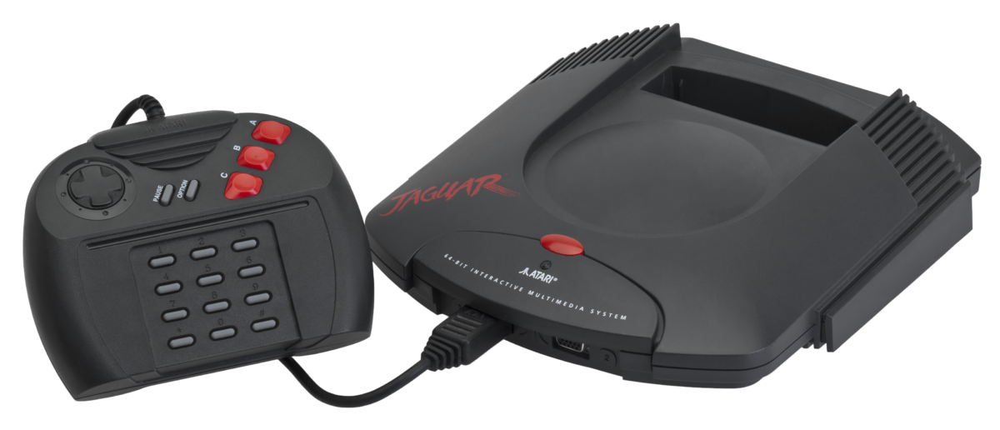

.. Created by Payton McBurney

Atari
=====

.. table:: **Notable Consoles**

    ============== =======================
     Name           North America Release
    ============== =======================
     Home Pong      January 1975
     Atari 2600     September 1977
     Atari Jaguar   November 1993
    ============== =======================

*********
Home Pong
*********

    Home Pong [#f1]_

After the success of *Pong*, Atari decided to develop a home console version. After releasing in 1975, Magnavox filed
suit against Atari, as Magnavox believed that Atari had infringed upon the patents and concept of electronic ping-pong
based on the Magnavox Odyssey's design process. Atari ultimately settled with Magnavox out of court.

**********
Atari 2600
**********

    Atari 2600 [#f2]_

The Atari 2600 is credited with popularizing the use of microprocessor based hardware and games stored on ROM cartridges
instead of dedicated hardware with games built into the console. It was launched in 1977 in the second generation of
home video game consoles. The Atari 2600 was arguably the most popular video game console of the second generation,
selling nearly 30 million units by the time it was discontinued in 1992.

Many popular games were released on the Atari 2600, which helped contribute to its popularity. Some examples of the
games released on the Atari 2600 include:

* *Adventure*

* *Breakout*

* *Space Invaders*

* *Asteroids*

* *Missile Command*

* *Pac-Man*

A full list of games released for the Atari 2600 can be found on Wikipedia `here`_.

.. _here: https://en.wikipedia.org/wiki/List_of_Atari_2600_games

************
Atari Jaguar
************

    Atari Jaguar [#f3]_

Released in the fifth generation of home video game consoles alongside consoles such as the Nintendo 64 and Playstation,
the Atari Jaguar was much less successful than previous Atari consoles. There were less than 250,000 units sold before it
was discontinued in 1996. The commercial failure of the Atari Jaguar ultimately led to Atari leaving the video game
console market.

.. rubric:: Footnotes

.. [#f1] Amos, E. (2012). Telegames Atari Pong. Retrieved from
    https://en.wikipedia.org/wiki/File:TeleGames-Atari-Pong.png.
.. [#f2] Amos, E. (2011). Atari 2600 Wood 4Sw Set. Retrieved from
    https://commons.wikimedia.org/wiki/File:Atari-2600-Wood-4Sw-Set.png.
.. [#f3] Amos, E. (2012). Atari Jaguar Console Set. Retrieved from
    https://commons.wikimedia.org/wiki/File:Atari-Jaguar-Console-Set.png.
