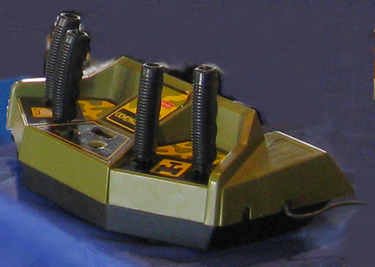
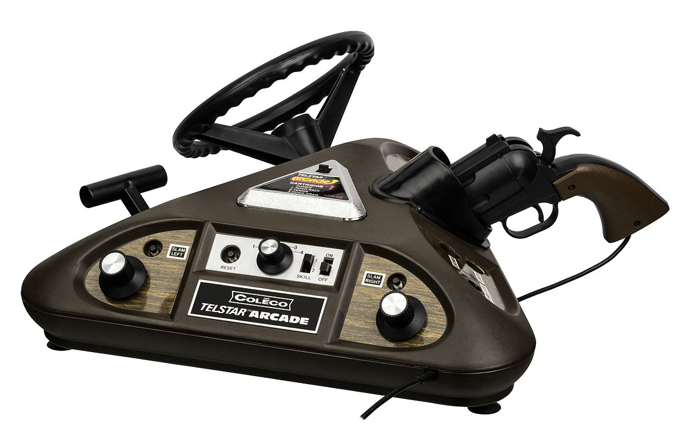
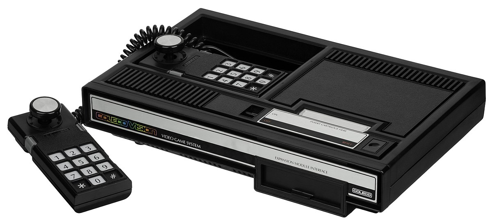

.. Created by Payton McBurney

Coleco
======

.. table:: **Notable Consoles**

    ============== =======================
     Name           North America Release
    ============== =======================
     Telstar        1976 - 1978
     ColecoVision   August 1982
    ============== =======================

*******
Telstar
*******

.. figure:: telstar.jpg
    :width: 50%

    Coleco Telstar [#f1]_

From 1976 to 1978, Coleco released the Telstar series of home video game consoles. There were fourteen consoles released
in total, some of which can be found below. Overall, approximately one million Telstar consoles were sold.

* Telstar

  * The original Telstar includes two fixed paddles. Most of the games in the original Telstar were *Pong* variants,
    including hockey, handball, and tennis.

* Telstar Deluxe

  * This version of the Telstar was made for the Canadian market, with both French and English text.

* Telstar Ranger

  * The Telstar Ranger includes a Colt 45 style light gun and separate paddle controllers. It contains twice as many
    games as the original Telstar, two of which are target games

* Telstar Alpha

  * This version of the Telstar came in a black and white case. The four ball games contained within feature an
    automatic serving function as well as three difficulty levels (beginner, intermediate, and professional).

* Telstar Colormatic

  * The Telstar Colormatic had detached wired paddles as well as colored graphics, with a different color for each
    game.

    Coleco Telstar Combat! [#f2]_

* Telstar Combat!

  * The Telstar Combat! was unique in that it had four fixed joysticks rather than paddles. It also included an
    entirely different lineup of games, all of which were variations on the game |Tank|_.

.. _Tank: https://en.wikipedia.org/wiki/Tank_(video_game)

.. |Tank| replace:: *Tank*

* Telstar Colortron

  * This version had fixed paddles, color graphics, and built in sounds.

* Telstar Marksman

  * The Telstar Marksman included a larger light gun with removable stock. It was also in color.

* Telstar Gemini

  * This version of the Telstar contained a light gun, two flipper buttons on the left and right sides of the case,
    as well as a pinball launch button. It contained two shooting games and four pinball games.

    Coleco Telstar Arcade [#f3]_

* Telstar Arcade

  * The Telsar Arcade used cartridges instead of built-in games. It was a triangular case that included a light gun,
    steering wheel with gear shift, and paddles on each side.

*************
ColecoVision
*************

    ColecoVision [#f4]_

The ColecoVision was a second generation console released in 1982. It performed better than the Telstar, selling over
two million units by the time it was discontinued in 1985 when Coleco left the video game market.

The ColecoVision was known for its capability to produce smooth graphics as well as its ability to offer a closer
experience to more powerful arcade games than its competitors in the Atari 2600. Coleco also released a series of
hardware add-ons to expand the capabilities of the console.

.. rubric:: Footnotes

.. [#f1] Maddmaxstar. (2006). Ctelstar. Retrieved from https://en.wikipedia.org/wiki/File:Ctelstar.jpg.
.. [#f2] AUIC Official. (2012). Telstar Combat. Retrieved from https://en.wikipedia.org/wiki/File:Telstar_Combat.jpg.
.. [#f3] Amos, E. (2015). Coleco Telstar Arcade Pongside L. Retrieved from
    https://en.wikipedia.org/wiki/File:Coleco-Telstar-Arcade-Pongside-L.jpg.
.. [#f4] Amos, E. (2014). ColecoVision wController L. Retrieved from
    https://en.wikipedia.org/wiki/File:ColecoVision-wController-L.jpg.
