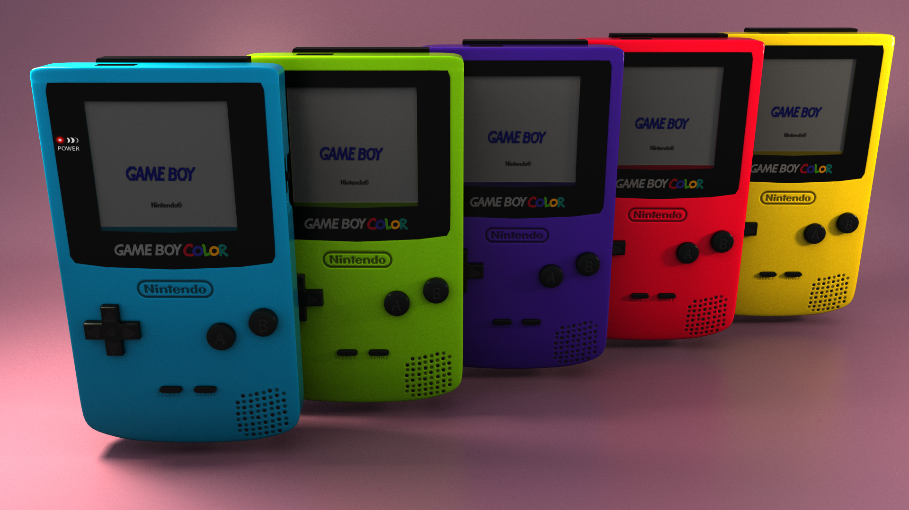
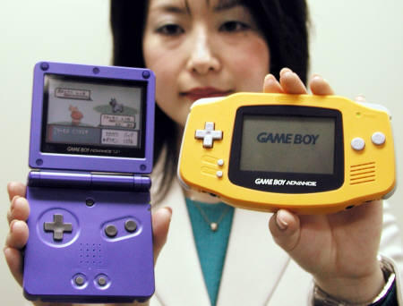

Game Boy Family
===============
The Nintendo Game Boy changed the way people looked at portable or hand-held
gaming devices. The only company to attempt prior to Nintendo was the Milton Bradley
Company with Microvision, the first handheld game console. This did not
take off, however as it had a small screen and a lack of content support. In
comes the Game Boy, released on April 21, 1989. Pushing it to the top, and
ultimately setting a precedent for hand-held gaming, was the game Tetris. At
the time, Tetris was widely popular, and the move to put it on the Game Boy
may just be one of the smartest moves Nintendo made as a company. Nintendo would go
on to create the Game Boy Pocket, which was redesigned Game Boy, as well as
the Game Boy Light, which was a variant released only in Japan.

*Nintendo Game Boy* [#f1]_

The next major improvement would not happen until the release of the Game
Boy Color on October 21, 1998. It added a color screen to the already
popular Game Boy. A major addition to the Game Boy color was the added backward
compatibility, which would allow the ability to play older Game Boy cartridges.
This would become a major feature of the Game Boy line.

*Nintendo Game Boy Color* [#f2]_

Then came the final major upgrade, the Game Boy Advance. This console
featured a larger, higher resolution screen, and the addition of the L and R
buttons. This system was also known for being more powerful than its predecessors.
The lone criticism of this device was that the screen was not backlit, meaning
it would often be difficult to view content.

*Nintendo Game Boy Advance SP (left) and Game Boy Advance (right)* [#f3]_

Then comes the Game Boy Advance SP, released on February 14, 2003, which largely
resolved some of the Game Boy Advance's problems. This included a switchable
internal front light and a rechargeable battery. This console plays a special
role in my heart, as it was the first console I received when I was 5-years-old
(at least until my brother flushed it down the toilet). This was the final Game
Boy to be developed with backward compatibility and ushered in the new age of
hand-held consoles.

.. rubric:: Footnotes
.. [#f1] "`Nintendo Game Boy <https://www.engadget.com/2019/04/21/nintendo-game-boy-30th-anniversary/>`_".
            Engadget. (2019, April 21). Retrieved December 05, 2019.

.. [#f2] Color
.. [#f3] Advance