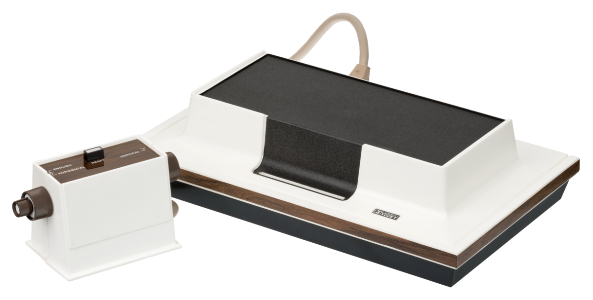
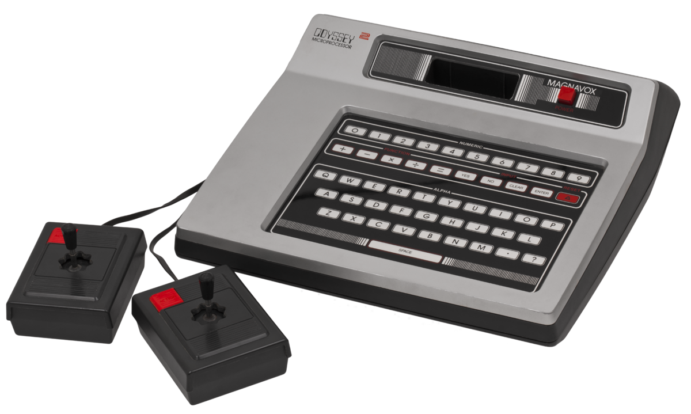

.. Created by Payton McBurney

Magnavox
========
.. table:: **Notable Consoles**

    ==================== =======================
     Name                 North America Release
    ==================== =======================
     Odyssey              September 1972
     Odyssey\ :sup:`2`\   February 1979
    ==================== =======================

*******
Odyssey
*******

    Magnavox Odyssey [#f1]_

The Odyssey was the first commercial home video game console. Its release in September 1972 started the first generation
of home video game consoles and marked the rise of the commercial video game industry.

The Odyssey does not have any sound capabilities. It can display three square monochrome dots and a single line on the
screen, which can be controlled with the button and knobs on the controller according to the rules of the game played.
The console came with plastic overlays to place over the screen to create more interesting visuals with the three dots.
It also came packaged with various boardgame pieces used with these games, such as dice and game cards.

One of the 28 games released for the Odyssey was a ping pong game, which inspired Pong. The console sold approximately
350,000 units by the time it was discontinued in 1975.

******************
Odyssey\ :sup:`2`\
******************

    Magnavox Odyssey\ :sup:`2`\  [#f2]_

Also known as the Philips Odyssey\ :sup:`2`\, the Magnavox Odyssey\ :sup:`2`\  is a second generation home video game
console that released in 1978. The Odyssey\ :sup:`2`\  changed the original controller design of the Odyssey to the more
standard joystick design of the 1970s and early 1980s.

It performed better than the Odyssey, selling approximately two million units but
performed worse than its competitors in the Atari 2600 and Intellivision. This was due, in part, to its lackluster
graphics and lack of colors, although they were certainly an improvement on the Odyssey’s simple graphics. It was
discontinued in 1984.

.. rubric:: Footnotes

.. [#f1] Amos, E. (2015). Magnavox Odyssey Console Set. Retrieved from
    https://commons.wikimedia.org/wiki/File:Magnavox-Odyssey-Console-Set.png.
.. [#f2] Amos, E. (2011). Magnavox Odyssey 2 Console Set. Retrieved from
    https://commons.wikimedia.org/wiki/File:Magnavox-Odyssey-2-Console-Set.png.