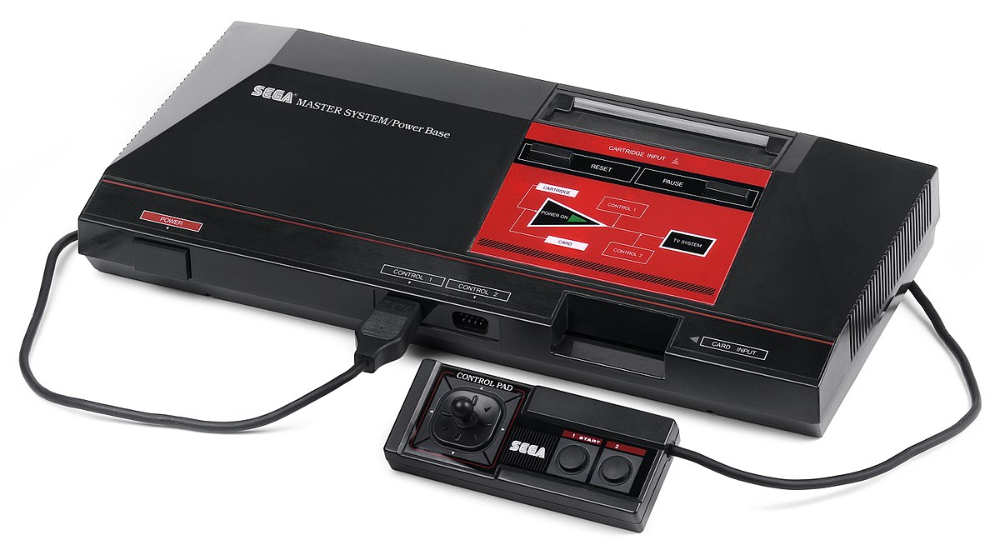
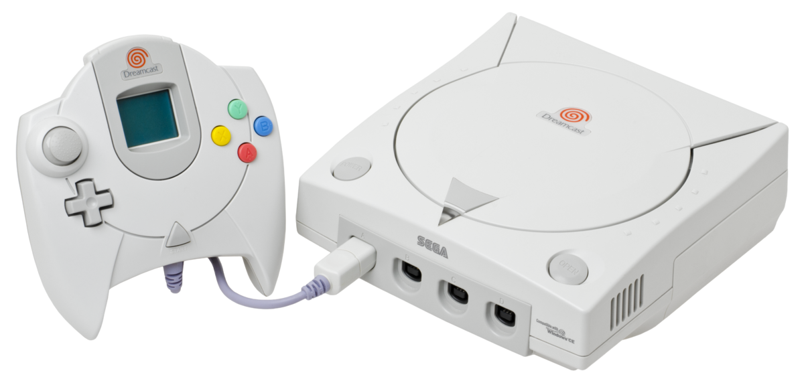

.. Created by Payton McBurney

Sega
====

.. table:: **Notable Consoles**

    =============== =======================
     Name            North America Release
    =============== =======================
     Master System   September 1986
     Dreamcast       September 1999
    =============== =======================

*************
Master System
*************

    Sega Master System [#f1]_

The Sega Master System was is a third generation video game console released in 1986. In the early 1980s, Sega
Enterprises, Inc. was one of the largest arcade game manufacturers in the United States. With the decline of the arcade
business starting in 1982, Sega decided to use its hardware expertise to move into the home video game market in Japan.
The Master System was the third iteration of console produced by Sega, selling between 10 million and 13 million units.

During this time period, Nintendo dominated the gaming market in the United States with the NES, so the Master System
did not perform particularly well in the United States. It did, however, get traction in Europe, where it held a
significant part of the console market, and Brazil, where it sold nearly 300,000 units.

*********
Dreamcast
*********

    Sega Dreamcast [#f2]_

The Dreamcast was the last console produced by Sega, ending the company's eighteen years in the video game console
market. Released in the United States in the sixth generation of video game consoles, the Dreamcast had to compete
with the Nintendo Gamecube, Sony's Playstation 2, and Microsoft's Xbox, all of which were widely successful. This made
Dreamcast one of the weakest of the sixth generation consoles, selling only 9.13 million units before it was
discontinued in 2001. The poor sales of the Dreamcast ultimately led to Sega leaving the video game console market and
restructuring itself as a third-party publisher.

Despite its poor performance in the console market, the Dreamcast was considered by some to be ahead of its time. It
featured many innovative games of the time. It was also the first console to include a built-in modem for internet
support.

.. rubric:: Footnotes

.. [#f1] Amos, E. (2011). Sega Master System Set. Retrieved from
    https://en.wikipedia.org/wiki/File:Sega-Master-System-Set.jpg.
.. [#f2] Amos, E. (2012). Dreamcast Console Set. Retrieved from
    https://en.wikipedia.org/wiki/File:Dreamcast-Console-Set.png.
