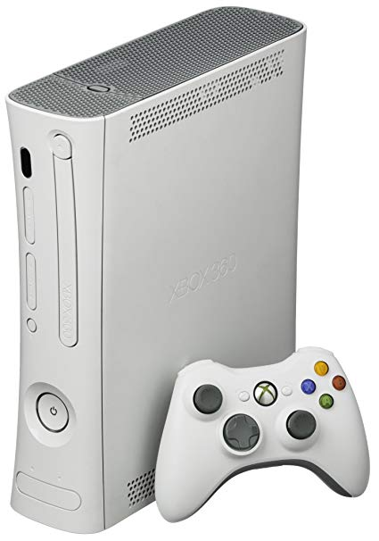

Xbox 360
========
The Xbox 360 was released as the successor of the
original Xbox in November 2005, competing with Sony's
PlayStation 3 and Nintendo's Wii as part
of the seventh generation of video game consoles.

source: https://images-na.ssl-images-amazon.com/images/I/81%2Blz2g6bJL._SY606_.jpg

   history
   old_home_consoles
   handheld_consoles
   xboxhistory
   xbox
   xbox360
   xboxone